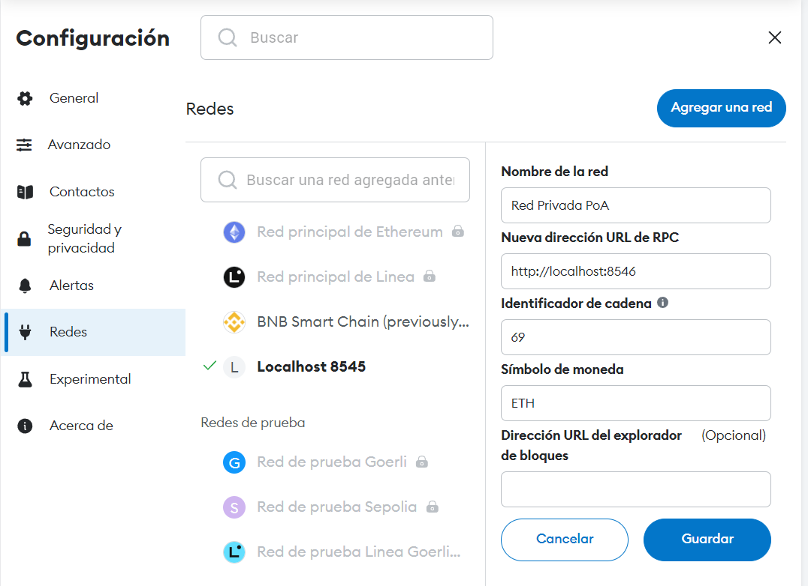

# Creation of a PoA (Proof of Authority) private ethereum network

### 1. Clone the repo and create the directory of the node

Create the directory in which all the data related to the node will be created/saved.

```bash
git clone -b dev https://github.com/juangas/Proyecto_ETH_CC_Grupo_1.git
cd Proyecto_ETH_CC_Grupo_1/nodes/basic_node
mkdir node_1
```

### 2. Create a new account address for the node:

```bash
docker run --rm -it -v $PWD/node_1:/root/.ethereum ethereum/client-go --datadir /root/.ethereum account new
```

The command will prompt for a password, in my case for testing purposes I have not included any one.

Example output

```bash
Your new account is locked with a password. Please give a password. Do not forget this password.
Password:
Repeat password:

Your new key was generated

Public address of the key: 0x8631AC0F35483eD63167c26F7aE18567e79c519A
Path of the secret key file: node1/keystore/UTC--2022-05-13T14-25-49.229126160Z--c1b2c0dfd381e6ac08f34816172d6343decbb12b

- You can share your public address with anyone. Others need it to interact with you.
- You must NEVER share the secret key with anyone! The key controls access to your funds!
- You must BACKUP your key file! Without the key, it's impossible to access account funds!
- You must remember your password! Without the password, it's impossible to decrypt the key!
```

Copy the public address and save it (in my case `0x8631AC0F35483eD63167c26F7aE18567e79c519A`), it will be needed in latter steps.

### 3. Modify the following parameters in the `genesis.json` file:

- `chainId`: Select the id of the private ethereum network, you can choose any positive integer less the id 1 (mainnet chainId).

- `alloc`: In this field will be included the addresses that will start with a determinated balance. It is recommended to include your wallets to be able to make tx's and test the network.

- `extradata`: This parameter has all the addresses of the signers that will be the nodes that will act as validators. Include the address generated in the previous step.

Example `genesis.json`:

```json
{
  "config": {
    "chainId": 69,
    "londonBlock": 0,
    "homesteadBlock": 0,
    "eip150Block": 0,
    "eip155Block": 0,
    "eip158Block": 0,
    "byzantiumBlock": 0,
    "constantinopleBlock": 0,
    "petersburgBlock": 0,
    "istanbulBlock": 0,
    "berlinBlock": 0,
    "clique": {
      "period": 5,
      "epoch": 30000
    }
  },
  "difficulty": "1",
  "gasLimit": "8000000",
  "extradata": "0x00000000000000000000000000000000000000000000000000000000000000008631AC0F35483eD63167c26F7aE18567e79c519A0000000000000000000000000000000000000000000000000000000000000000000000000000000000000000000000000000000000000000000000000000000000",
  "alloc": {
    "0x3aBB6C5ab2c65381D341573213Feaf4dE09681fF": {
      "balance": "1000000000000000000000000"
    }
  }
}
```

Copy the file into the node directory:

```bash
cp genesis.json node_1/
```

### 4 Init the configuration node

In this step the node directory will be populated with all the files needed to start. Execute the command to create the configuration files:

```bash
docker run --rm -it -v $PWD/node_1:/root/.ethereum ethereum/client-go init /root/.ethereum/genesis.json
```

### 5 Run the node

With this command will be executed the node and the network will be alive. The network has to be accesible. The only thing that has to be changed is the `--miner.etherbase` and `--unlock` parameters with the public address generated in the step 2. Also if a password was provided in the address creation you will need to provide it by the passing the path of the file containing the password in `--password` parameter.

```bash
docker run --rm -it \
  -p 8546:8546 \
  -p 30303:30303 \
  -v $PWD/node_1:/root/.ethereum \
  ethereum/client-go \
  --http \
  --http.addr 0.0.0.0 \
  --http.port 8546 \
  --http.api web3,eth,net,debug,personal,txpool \
  --datadir=/root/.ethereum \
  --unlock 0x8631AC0F35483eD63167c26F7aE18567e79c519A \
  --password <(echo "") \
  --mine \
  --miner.etherbase 0x8631AC0F35483eD63167c26F7aE18567e79c519A \
  --allow-insecure-unlock
```

To access the node from your metamask you will need to add the network to it. In the following image all the configuration parameters to add the network are included.



Once filanizing all the steps you will be able to make txs in your private PoA ethereum network.

### Usando GETH

1 creados dos nodos

```bash
mkdir node_1
mkdir node_2
```

2 accedemos al nodo_1 y creamos su cuenta

```bash
cd node_1
geth --datadir "./data" account new
```

Introducimos pwd
nos genera la siguiente respuesta

```
Your new key was generated

Public address of the key:   0xAA43Bc7a944240a7962E13B20fD25A24e1D66a53
Path of the secret key file: data/keystore/UTC--2023-11-30T16-06-12.190278000Z--aa43bc7a944240a7962e13b20fd25a24e1d66a53

- You can share your public address with anyone. Others need it to interact with you.
- You must NEVER share the secret key with anyone! The key controls access to your funds!
- You must BACKUP your key file! Without the key, it's impossible to access account funds!
- You must REMEMBER your password! Without the password, it's impossible to decrypt the key!
```

3. realizamos la misma operacion para el node_1

```bash
cd ../node_2
geth --datadir "./data" account new
```

obtenemos una respuest similar a la anterior

```
Your new key was generated

Public address of the key:   0xa0Ce2b92944cf7bd5c71607C215a6e911E19313A
Path of the secret key file: data/keystore/UTC--2023-11-30T16-16-32.082739000Z--a0ce2b92944cf7bd5c71607c215a6e911e19313a

- You can share your public address with anyone. Others need it to interact with you.
- You must NEVER share the secret key with anyone! The key controls access to your funds!
- You must BACKUP your key file! Without the key, it's impossible to access account funds!
- You must REMEMBER your password! Without the password, it's impossible to decrypt the key!
```
