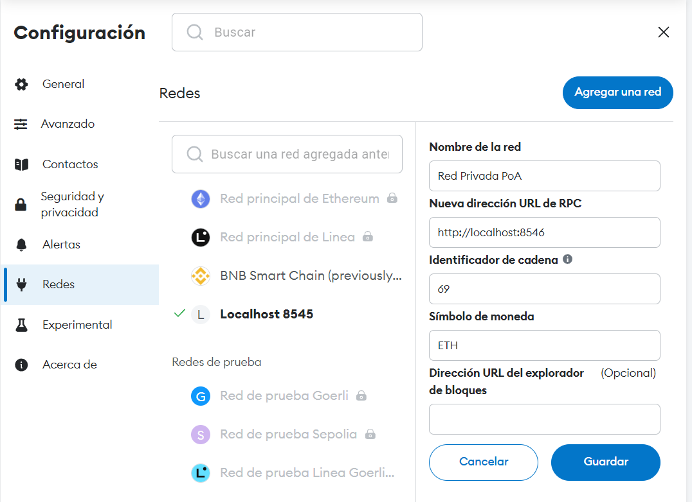

# Creation of a PoA (Proof of Authority) private ethereum network

### 1. Clone the repo and create the directory of the node

Create the directory in which all the data related to the node will be created/saved.

```bash
git clone -b dev https://github.com/juangas/Proyecto_ETH_CC_Grupo_1.git
cd Proyecto_ETH_CC_Grupo_1/nodes/docker-compose
```

### 2. Excute the docker-compose:

```bash
docker-compose -f compose.yaml up
```

In aproximately 20 seconds you will have a network with a total of 4 nodes:

- bootnode: This node is in charge of the networking to the rest of the nodes. 1 node.
- validator_node: It is a node in charge of mine new blocks. 1 node.
- normal_nodes: Nodes that saves a copy of the blockchain. 2 nodes.

You can see the configuration of each node in the `private_network` directory.

You can connect to anyone of the nodes except the bootnode (There is not exposed http port on this node).

- node_1 (validator node) port 8578.
- node_2 (normal node) port 8579.
- node_3 (normal node) port 8580.



Once filanizing all the steps you will be able to make txs in your private PoA ethereum network.

### Posibles error:

- Network proyecto_eth_cc_grupo_1_chainnet

```
failed to create network proyecto_eth_cc_grupo_1_chainnet: Error response from daemon: Pool overlaps with other one on this address space
```

This error means the range of IPs selected are in use. To avoid this you can change the IP 172.26.0.100 --> 172.26.0.0/24. Remember to change the other IPs.

- IPC opening failed
  To avoid this error you can use the flag --ipcdisable in the scripts to start the nodes.
  Scripts:

* crear_directorios.sh --> geth --datadir=/root/.ethereum/bootnode --nat extip:$BOOT_IP --ipcdisable --bootnodes $BOOTNODE
* ejecutar_node_normal.sh --> geth --http --http.addr 0.0.0.0 --http.port $PORT --http.api web3,eth,net,debug,personal,txpool --http.corsdomain '\*' --datadir=/root/.ethereum --ipcdisable --bootnodes $BOOTNODE
* ejecutar_nodo_validador.sh --> geth --http --http.addr 0.0.0.0 --http.port $PORT --http.api web3,eth,net,debug,personal,txpool --http.corsdomain '*' --datadir=/root/.ethereum --unlock $(echo "$WALLET_ADDRESS") --password /root/.ethereum/password.txt --mine --miner.etherbase $(echo "$WALLET_ADDRESS") --allow-insecure-unlock --nat extip:172.25.0.101 --ipcdisable --bootnodes $BOOTNODE
